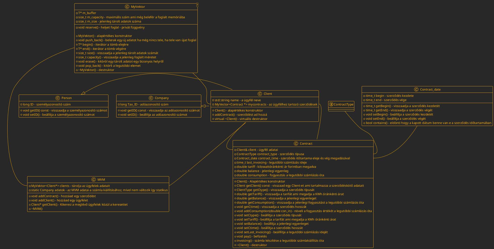

# MVM
**<h1 align="center">Házi Feladat </h1>**

<h2 align = "center">Terv</h2>
<h2 align = "center">Jajecnik Marcell- DMB3AD</h3>
<h2 align = "center">2023. 05. 03.</h2>

# A program struktúrája

*A program osztálydiagramja, a fontosabb adattagokkal és függvényekkel*

- A person és a company osztályok publikus módon öröklődnek a client-ből
- A myvektor generikus osztály az indexelhetőséghez
- A myvektor amennyiben betelik az eddigi méretének dupláját foglalja
- Egy emberhez több szerződés is kapcsolódhat